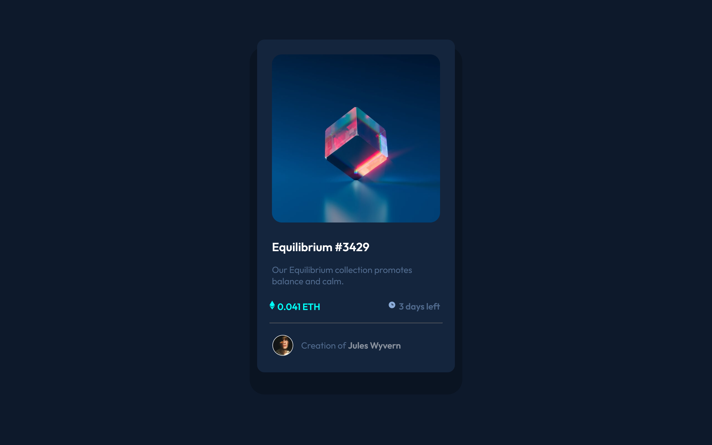
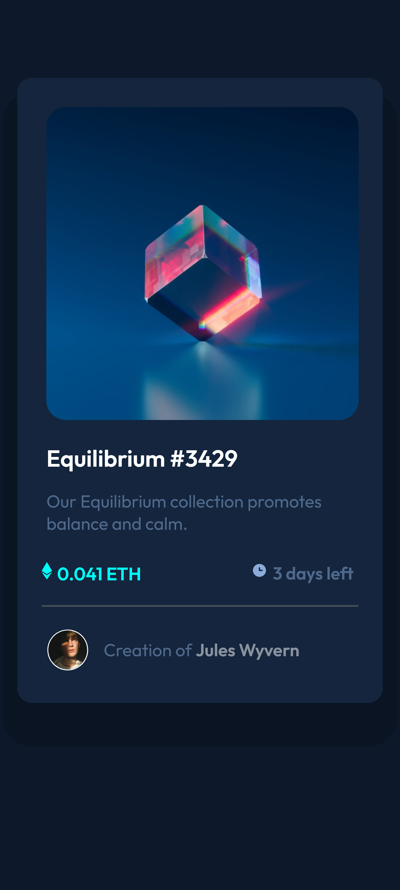

# Frontend Mentor - NFT preview card component solution

This is a solution to the [NFT preview card component challenge on Frontend Mentor](https://www.frontendmentor.io/challenges/nft-preview-card-component-SbdUL_w0U). Frontend Mentor challenges help you improve your coding skills by building realistic projects. 

## Table of contents

- [Overview](#overview)
  - [The challenge](#the-challenge)
  - [Screenshot](#screenshot)
- [My process](#my-process)
  - [Built with](#built-with)
  - [What I learned](#what-i-learned)
  - [Continued development](#continued-development)
  - [Useful resources](#useful-resources)
- [Author](#author)

<!-- **Note: Delete this note and update the table of contents based on what sections you keep.** -->

## Overview

### The challenge

Users should be able to:

- View the optimal layout depending on their device's screen size
- See hover states for interactive elements

### Screenshot




## My process

### Built with

- Semantic HTML5 markup
- CSS custom properties
- Flex
- Mobile-first workflow

### What I learned

Use this section to recap over some of your major learnings while working through this project. Writing these out and providing code samples of areas you want to highlight is a great way to reinforce your own knowledge.

To see how you can add code snippets, see below:

```html
<h1>Some HTML code I'm proud of</h1>
```
```css
.overlay:hover {
  opacity: 0.5;
}

.card {
  box-shadow: 0 30px 0 15px rgba(0, 0, 0, 0.2);
}

.flex {
  display: flex;
  flex-wrap: wrap;
}

@media screen
```

<!-- If you want more help with writing markdown, we'd recommend checking out [The Markdown Guide](https://www.markdownguide.org/) to learn more.

**Note: Delete this note and the content within this section and replace with your own learnings.** -->

### Continued development

I wanted to continue designing website with more simple and easy to use but have an elegant display. This will be my target, and I will continue to learn in order to make that come true.

<!-- **Note: Delete this note and the content within this section and replace with your own plans for continued development.** -->

### Useful resources

- [W3schools](https://www.w3schools.com/) - This helped me for to know the tag of css and its attributes.
- [Random Yt channel](https://www.youtube.com) - I randomly checked videos, and after imitating from many tutorials, finally I understand how it works.
<!-- 
**Note: Delete this note and replace the list above with resources that helped you during the challenge. These could come in handy for anyone viewing your solution or for yourself when you look back on this project in the future.** -->

## Author

- Website - [Ahmad Tiar K](https://github.com/ATiarK)
- Frontend Mentor - [@ATiarK](https://www.frontendmentor.io/profile/ATiarK)
<!-- - Twitter - [@yourusername](https://www.twitter.com/yourusername) -->

